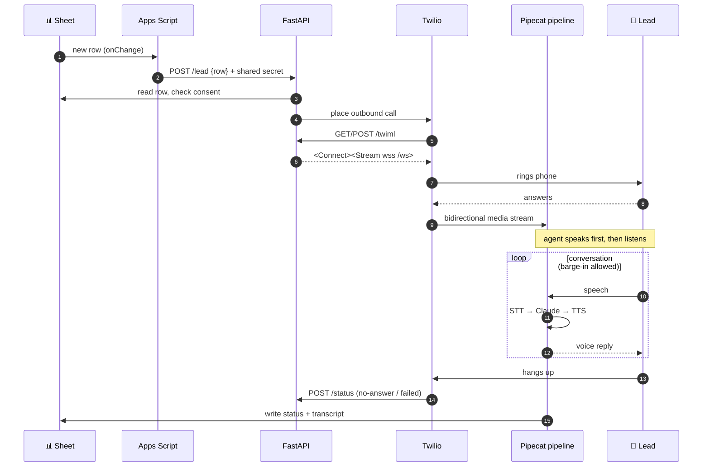
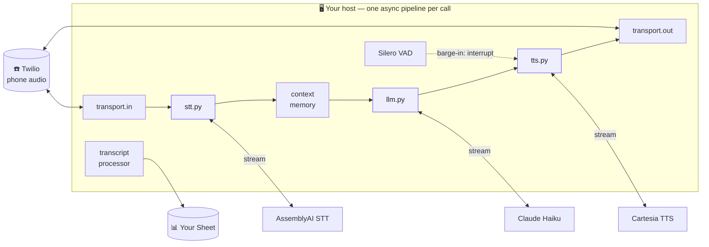

# 📞 OpenLine

**Speed-to-lead, self-hosted.** OpenLine calls a new lead back **within seconds** of
their form submit — an AI voice agent that dials the moment a row lands in your
Google Sheet, qualifies the lead in a natural back-and-forth, then writes the
status and full transcript back to that same row.

No hosted platform sits between you and the call. The Sheet is the queue, your
server runs the conversation, and you pay only the raw provider rates underneath.

<p>
  
  
  
  
  
  
</p>

---

## Why OpenLine is different

Most "AI calling" products are SaaS: you rent minutes, rent channels, and your
conversations live in someone else's database. OpenLine flips all of that.

| | OpenLine | Why it matters |
|---|---|---|
| ⚡ **Speed-to-lead** | An `onChange` trigger fires the call the instant a row appears — no polling, no batch. | Hot leads go cold in minutes. OpenLine reaches them while intent is still warm. |
| 💸 **Low-cost by design** | Self-hosted. You pay raw Twilio + STT + LLM + TTS rates, defaulting to **Claude Haiku** for the brain. No platform markup. | A per-minute SaaS fee on top of provider cost disappears entirely. |
| 🧵 **No concurrency tax** | Every call is one async pipeline inside your process. Concurrency is bounded only by your host and API rate limits. | Hosted platforms bill per concurrent channel. Here, scaling out is just more CPU. |
| 🔒 **Your data path** | Audio and transcripts flow only through *your* server and the APIs you choose. Transcripts land in *your* Sheet. | No third-party platform sits in the middle recording your conversations. |
| 🔁 **Zero lock-in** | STT, LLM, and TTS each live in **one swappable file**. Change a provider by editing one module. | Standard [Pipecat](https://github.com/pipecat-ai/pipecat) under the hood — never married to one vendor. |

---

## How it works

A lead submits a form → a row appears → OpenLine calls them → the transcript
comes back to the row. One closed loop, no dashboard to babysit.

```mermaid
flowchart LR
    A[📝 Lead submits<br/>interest form] --> B[(Google Sheet<br/>new row)]
    B -->|Apps Script<br/>onChange| C[FastAPI /lead]
    C --> D{consent<br/>given?}
    D -->|no| E[mark failed,<br/>never dial]
    D -->|yes| F[☎️ Twilio<br/>outbound call]
    F --> G[🎙️ Pipecat pipeline<br/>STT → Claude → TTS]
    G -->|call ends| H[(Sheet row updated<br/>status + transcript)]
    H -. closed loop .-> B

    classDef sheet fill:#0F9D58,stroke:#0B7A43,color:#fff;
    classDef call fill:#F22F46,stroke:#B71C2E,color:#fff;
    class B,H sheet;
    class F,G call;
```

<details>
<summary>Plain-text fallback (no Mermaid)</summary>

```
New row in Sheet
   │  (Apps Script onChange → POST /lead)
   ▼
FastAPI /lead ── checks consent ── Twilio outbound call
   │
   ▼  Twilio fetches /twiml → Connect/Stream to wss /ws
Pipecat pipeline:  Twilio MediaStream ⇄ AssemblyAI STT → Claude Haiku → Cartesia TTS
   │
   ▼  call ends
Status + transcript written back to the row   ──┐
   └──────────────── closed loop ───────────────┘
```
</details>

- **Trigger:** Apps Script `onChange` POSTs the new row number to `/lead`. Only
  rows with a blank `status` fire — this both detects new leads and stops the
  server's own write-back from re-triggering a call.
- **Turn detection:** AssemblyAI Universal-3 Pro Streaming owns end-of-turn
  endpointing; a local Silero VAD handles only barge-in (see below).

---

## Anatomy of a single call



---

## Inside the pipeline

One [Pipecat](https://github.com/pipecat-ai/pipecat) cascading pipeline per call.
Each provider talks to its own external API; everything orchestrating the call
runs on **your** host. Swap any box by editing its one file.



<details>
<summary>Plain-text fallback (no Mermaid)</summary>

```
Twilio MediaStream
   ⇅
[transport.in] → [STT: stt.py] → [context memory] → [LLM: llm.py] → [TTS: tts.py] → [transport.out]
                                                                          ▲
                        [Silero VAD] ── barge-in: interrupt ─────────────┘
   ⇅
[transcript processor] → Your Google Sheet

External APIs (swappable, one file each):  STT→AssemblyAI   LLM→Claude   TTS→Cartesia
```
</details>

**Barge-in:** the caller can interrupt the agent mid-sentence. Silero VAD detects
speech onset locally and fires the interrupt; AssemblyAI still decides when the
caller's *turn* is actually finished. Fast cut-in, accurate end-of-turn.

---

## Quickstart

### Prerequisites

- **[uv](https://docs.astral.sh/uv/)** — Python package/venv manager.
  ```bash
  curl -LsSf https://astral.sh/uv/install.sh | sh
  ```
- **[ngrok](https://ngrok.com/)** — local-dev only, exposes the server to Twilio.
  Not needed in production (use a real domain).
  ```bash
  brew install ngrok                       # macOS
  ngrok config add-authtoken <YOUR_TOKEN>  # free token from dashboard.ngrok.com
  ```
- Accounts/keys: Twilio, AssemblyAI, Anthropic, Cartesia, and a Google Cloud
  service account (see step 2).

### 1. Install

```bash
uv sync                # creates the venv, installs locked deps
cp .env.example .env   # then fill it in
```

### 2. Google service account

1. In Google Cloud, create a service account and download its JSON key.
2. Enable the **Google Sheets API** and **Google Drive API** for the project.
3. Share the Sheet with the key's `client_email` as **Editor**.
4. Point `GOOGLE_SERVICE_ACCOUNT_JSON` at the key file (kept out of git).

### 3. Provider keys

Fill `.env` with Twilio, AssemblyAI, Anthropic, and Cartesia credentials and a
Cartesia `voice_id`. See `.env.example` for every variable.

### 4. Public URL

Twilio needs a public `wss` URL. For local dev:

```bash
ngrok http 8080
```

Set `PUBLIC_URL` to the forwarding host ngrok prints — host only, no scheme,
e.g. `abc123.ngrok-free.app`. The free host changes on each restart; update
`PUBLIC_URL` (and the Apps Script `SERVICE_URL`) and restart the server when it does.

### 5. Run

```bash
uv run python main.py
```

### 6. Apps Script trigger

Make the Sheet POST to the server whenever a new lead row appears.

1. **Open the editor.** In the Sheet: **Extensions → Apps Script**. A new
   editor tab opens with an empty `Code.gs`.
2. **Paste the script.** Delete whatever is in `Code.gs`, paste the full
   contents of `apps_script.gs`.
3. **Set the three constants** at the top of the file:
   - `SERVICE_URL` → `https://<PUBLIC_URL>/lead` (your ngrok host + `/lead`,
     **with** `https://`).
   - `SHARED_SECRET` → exact same value as `LEAD_SHARED_SECRET` in `.env`.
   - `SHEET_TAB` → your tab name (default `Sheet1`); must match `SHEET_TAB` in `.env`.
4. **Save.** Click the disk icon (or ⌘S).
5. **Add the trigger.** Left sidebar → **Triggers** (alarm-clock icon) →
   **Add Trigger** (bottom-right), then set:
   - Function to run: **onChange**
   - Deployment: **Head**
   - Event source: **From spreadsheet**
   - Event type: **On change**
   - Save.
6. **Authorize.** First save pops a Google auth dialog → pick your account →
   **Advanced → Go to \<project\> (unsafe)** → **Allow**. (Expected — it's your
   own script needing permission to read the Sheet and make outbound requests.)

**Test it:** with the server + ngrok running, add a row with a `phone` (E.164)
and blank `status`. The script flips `status` to `calling`, the agent dials, and
on hang-up the server writes `completed` / `no-answer` / `failed` + the transcript.

**Troubleshooting:**
- Nothing happens → check **Apps Script → Executions** for `onChange` runs/errors.
- `401` / no call → `SHARED_SECRET` ≠ `LEAD_SHARED_SECRET`.
- Connection error in logs → `SERVICE_URL` host stale (ngrok restarted) or server down.

---

## Sheet format

One worksheet doubles as the call queue. Header row (case-insensitive):

| name | phone | email | consent_given | status | transcript |
|------|-------|-------|---------------|--------|------------|

- `phone` in E.164 (e.g. `+15551234567`).
- `consent_given` truthy values: `true`, `yes`, `y`, `1`, `x`, `✓`.
- `status` / `transcript` are written by the server (`completed` / `no-answer` /
  `failed`). Leave them blank for new leads.

---

## Swapping a provider (no lock-in)

STT, LLM, and TTS each live in a single file exposing one factory function. To
change a provider, edit that one file — nothing else in the pipeline cares.

| Layer | File | Default | Swap to |
|-------|------|---------|---------|
| STT | `stt.py` | AssemblyAI Universal-3 Pro | any Pipecat STT service |
| LLM | `llm.py` | Claude Haiku (`LLM_MODEL` env) | another Claude tier — just an env change |
| TTS | `tts.py` | Cartesia | Rime — a ready commented stub at the bottom of the file |

```python
# tts.py — switch to Rime by replacing make_tts() with the stub:
def make_tts() -> RimeTTSService:
    return RimeTTSService(api_key=config.RIME_API_KEY, voice_id=config.RIME_VOICE_ID, model=config.RIME_MODEL)
```

---

## Security & consent

- `/lead` is guarded by the `X-Lead-Secret` shared secret. Without it, anyone who
  finds the URL could trigger calls (toll fraud). Keep the secret long and random.
- `consent_given` is checked before any call is placed; no-consent rows are
  skipped and marked `failed` — the agent never dials them.
- `.env` and `service_account.json` are gitignored. Never commit them.

---

## Project layout

```
main.py                  entrypoint (loads .env, runs uvicorn)
pyproject.toml           deps (managed by uv)
uv.lock                  pinned lockfile
.env.example
app.py                   FastAPI: /lead, /twiml, /ws, /status
pipeline.py              builds the Pipecat pipeline per call
stt.py                   AssemblyAI  (swappable)
llm.py                   Claude Haiku (swappable)
tts.py                   Cartesia, Rime slot (swappable)
sheet.py                 gspread read/write
twilio_client.py         outbound call + TwiML
prompt.py                agent system prompt
config.py                env vars
apps_script.gs           paste into the Sheet's Apps Script
```
